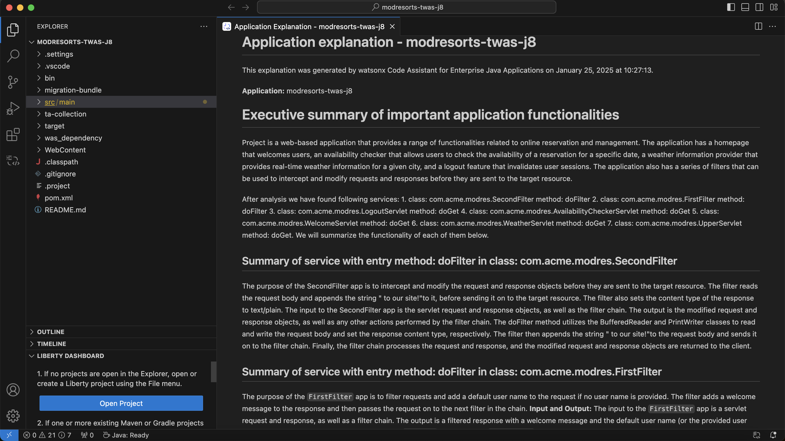
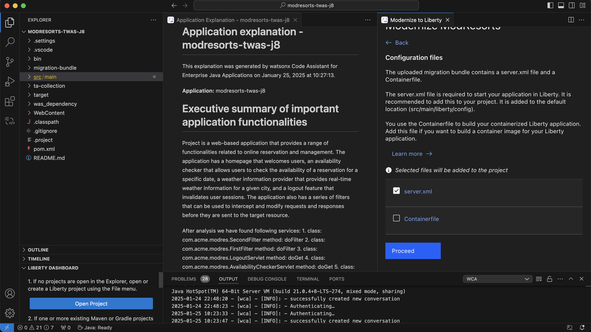

## Instructions for WCA workshop

### UserCase 1 : Liberty Modernaisation

--------

Note : Before starting this, Please ensure the necessary installations mentioned in pre-requesites 

#### Step 1: Chat Window

As soon as you click on the WCA icon, if the API key is having required credentials, you should be able to see the chat window. You can explore further with the help of prompt library to get started. 

#### Step 2: Import Java Project

Import the Java project into VS code

#### Step 3: Explain Application

Right click on the src folder and go to WCA menue and then click on Explian Applicaion 

The expain application will take few minutes to genreate

After the expliaination genration is completed, you can see the message as shown below

To View the explaition click on Show explaination

If you want to save the explaintaion, you can do the same by clicking on the save explaination button. 

#### Step 4: Modernize run time to Liberty

Below are the series of tasks that need to be completed inorder to modernize the application currently running on webshpere to liberty

1. Rightclick on the source and choose the modernize to libery option 

2. Wca will prompt options for analysing application 

3. Choose the migration Bundle that is already available in the project 

4. After choosing the migration bundle, we will get option to add the config files for liberty, choose the files to add to current project

5. After the above step, now we should be able to view the list of issues that are currently present that is preventing project to run on liberty. 

6. Before fixing the issue, let us try to run this application and check whehter the logout functionality is working fine and the liberty is configured correctly

7. Get the pornumber for liberty server

8. From the help of browser hit the liberty endpoint address

9. Click the logout button, you will notice the application breaks.

10. View the reason for applicaition failure

Now click on the fix auto fixes button, the WCA is able to fix the auto fixes by itself. 

11. After fixing the auto fixes, view the fixes that are mentioned under assisted fix 

12. Choose the entire class from the IDE and click on the help me button

13. Copy paste the code from the chat window to the class file and pom.xml file, the changes should look like below

14. Save the file changes and click on build and refresh

15. Notice that all issues are fixed and now you can verify whether the same is fixed by clicking the logout button in browser

